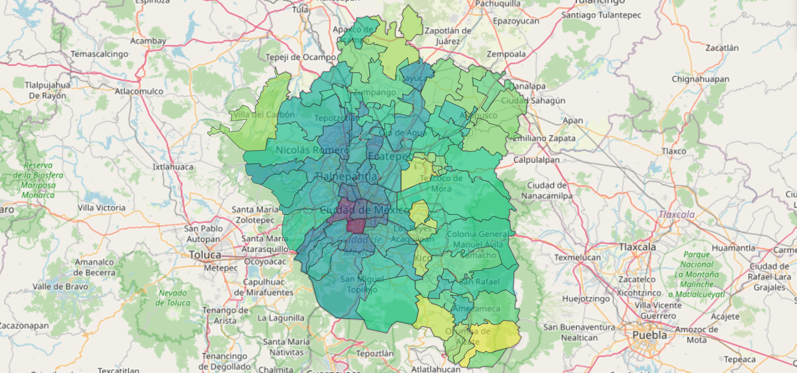

    

# Introducción a la Econometría Espacial Aplicada

**Descripción del taller:** 

En este taller de tres días se estudiarán métodos de análisis espacial para su aplicación en la investigación social. A lo largo del taller, se introducirán herramientas para hacer análisis exploratorio de datos espaciales y análisis de regresiones espaciales. En particular, se enfocará en especificar modelos econométricos tomando en cuenta los efectos de dependencia y heterogeneidad espacial. El principal objetivo del taller es comprender el alcance y las limitaciones de modelos de regresión espacial para su aplicabilidad en ciencias sociales mediante el uso de R.

**Objetivos:**  
-	Aprender qué es el análisis espacial, sus alcances y sus limitaciones.  

-	Aprender a aplicar los principios del análisis espacial mediante la exploración de datos espaciales y la estimación de regresiones espaciales para la investigación social.

-	Aprender a incorporar los efectos espaciales (dependencia y heterogeneidad espacial) en las especificaciones de modelos econométricos espaciales.

-	Mediante ejemplos, aprender a interpretar y presentar los resultados de una regresión espacial.

-	Aprender a utilizar las herramientas disponibles en software libre (R) para llevar a cabo análisis espacial. 

