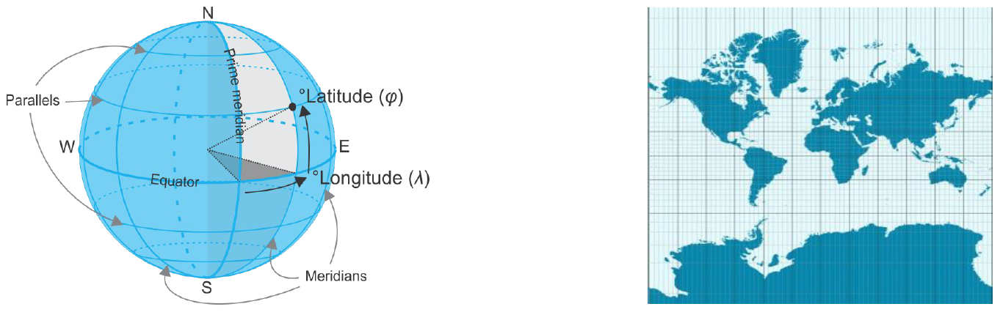
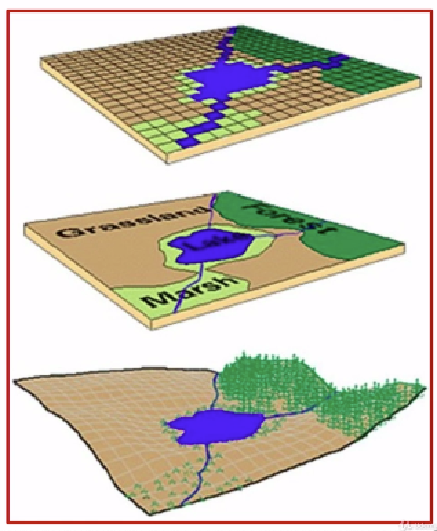
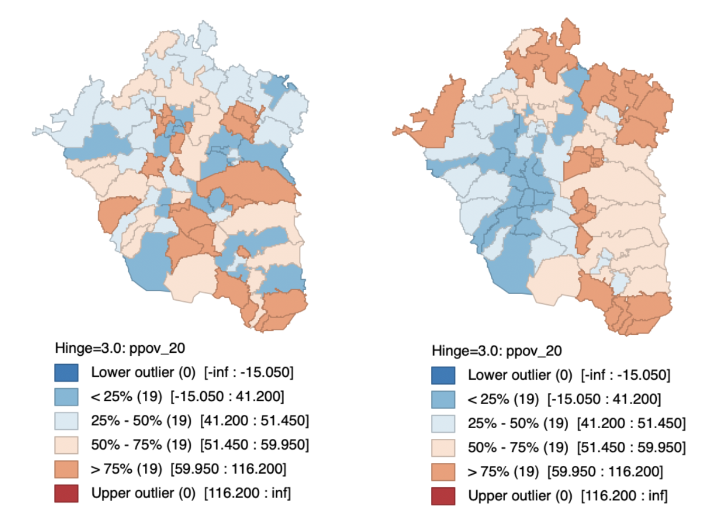
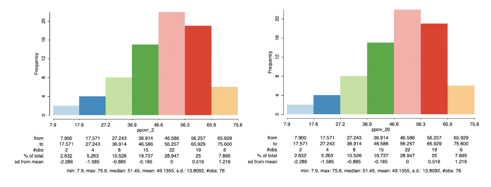
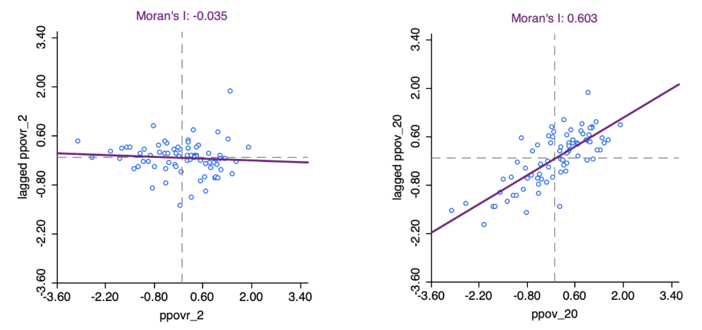
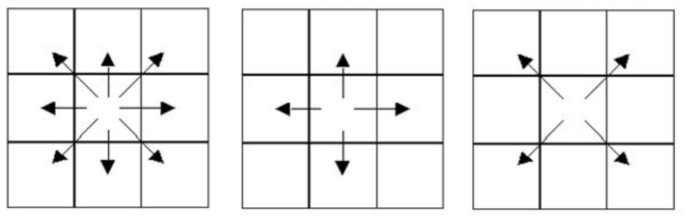
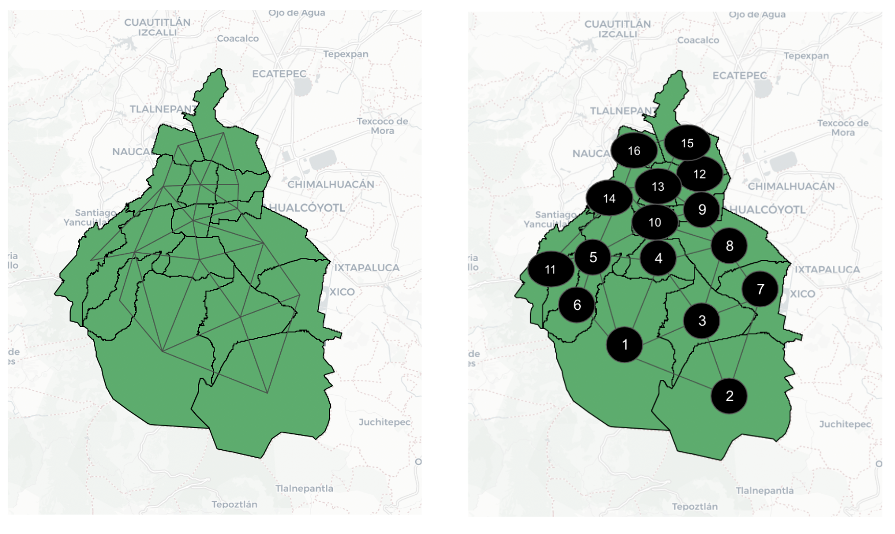

# Introducción a la Econometría Espacial Aplicada  
## GIS + Intro

[Download - [RMarkdown](https://github.com/ifarah/t/blob/main/sesion1.Rmd)]

**Importancia de las proyecciones:**

-   [Sistema de Referencia de
    Coordenadas](https://sumapa.com/crsxpais.cfm): Coordenadas que
    sitúan un punto en la esfera de la Tierra.

-   Diferencia entre SRC proyectados y no proyectados

    

-   Unidades (metros, pies (ft), para estimar áreas o distancias) *vs*
    Latitud y longitud (WGS84 (EPSG: 4326))

Por si les interesa leer más sobre [cómo elegir
proyecciones](https://source.opennews.org/articles/choosing-right-map-projection/)
en sus proyectos.

**Tipos de datos espaciales:**

-   Vectores (puntos, líneas, polígonos) (por ejemplo: shapefiles,
    geojson, json, kml, geopackage)  
-   Ráster (definen el espacio como un conjunto de celdas del mismo
    tamaño. Cada celda contine un valor) (por ejemplo: geotiff, netCDF,
    DEM)

**¿Qué es el análisis espacial?**  
- Datos geospaciales: ubicación + valores (atributos).  
- Análisis espacial: Cuando cambia la ubicación, el contenido de los
datos cambia.  
- Análisis no-espacial: la ubicacion NO importa (*locational
invariance*)

### Comparando análisis espacial *vs* no espacial:

#### Distribución espacial

#### Distribución no espacial

#### Autocorrelación espacial (Índice de Moran)

**¿Qué es la econometría espacial?**  
Tratamiento explícito de la ubicación:  
1. Especificación del modelo  
2. Estimación del modelo  
3. Diagnóstico del modelo  
4. Predicción del modelo

**Críticas de la econometría espacial:** (Goodchild & Longley 2021)

1.  Escala de nuestros datos (citando a Openshaw 1981)  
    ¿Cuál es la escala apropiada para estudiar el fenómeno que nos
    interesa? El problema de unidad de área modificable (MAUP): Definir
    unidad de análisis. Problema de escala y agregación. Variación de
    los resultados obtenidos en relación con el número de zonas en que
    se divide el total de la zona de estudio. Referencia a las
    diferencias que se producen cuando la información se agrega a una
    escala distinta.

2.  Falacia ecológica (interpretación)  
    Estimar en una escala agregada y concluir explicando el fenómenos a
    nivel individual. Por ejemplo, municipios con niveles altos de
    criminalidad no explican comportamiento criminal a nivel individual.

Tener información de estadísticas de salud a nivel punto y luego tener
información a nivel electoral y después datos agegados a nivel estado.
Solucionar agregando los datos a una sola unidad geográfica o imputando
datos mediante interpolación.

**Efectos espaciales:**

-   *Heterogeneidad espacial*  
    Características intrísecas distribuídas de forma desigual en el
    espacio.  
    Diferencias estructurales en los datos (cambian los coeficientes
    según la ubicación - structural breaks). Por ejemplo, diferencias
    entre el norte y el sur del país.

-   *Dependencia espacial*  
    Interacción entre los vecinos.  
    Soy el vecino de mi vecino. Estimar la interacción entre las
    ubicaciones de forma simultánea. Se puede estimar mediante la
    variable espacialmente rezagada, *spatial lag*
    (\[*W**y*\]*i*) que es el promedio de los valores de los
    vecinos de una observación.).

\[*W**y*\]*i* = *w**i*, 1*y*1 + *w**i*, 2*y*2 + *w**i*, 3*y*3 + *w**i*, *n**y**n*
o

$$\[Wy\]\_i = \\sum\_{j=1}^{n} w\_{i,j}y\_j$$

El problema con cuantificar los efectos espaciales es que es imposible
saber si los valores vienen de interacción (dependencia) o de
características intrínsecas (heterogeneidad).

**Autocorrelación Espacial**

Hipótesis nula: Aleatoriedad espacial. Queremos rechazar la hipótesis
nula.

La base de todo:  
*Primera Ley de Geografía de Tobler:* Todo depende de todo lo demás,
pero ubicaciones cercanas más (distancia de decaimiento).

Estadística de autocorrelación espacial (combina similitud atributos y
geográfica) (univariada a diferencia de correlación de Pearson).

-   Autocorrelación positiva (e.g., *clustering*).
-   Autocorrelación negativa (más difícil de identificar que la
    autocorrelación positiva por que no es claro cómo difiere de la
    aleatoriedad espacial, e.g., tablero de damas).

Como el cerebro nos engaña, tenemos que pensar como formalizar las
estructuras espaciales. Esto se logra imponiendo una estructura de pesos
espaciales (*Spatial Weights*), *w**i*, *j*

### Tipos de pesos más comúnes:

**1. Contigüidad (polígono)**  
- Queen (reina: vértices y aristas)  
- Rook (torre: aristas)  
- Bishop (alfil: vértices)  
- Pesos de distinto orden

**2. Distancia (puntos)**  
- KNN (k vecinos más cercanos) - Distancia

### Ejemplos de vecindad reina

Es importante que la matriz tenga muchos ceros (matriz dispersa). *A
priori* estamos definiendo la interacción (puede ser un problema, por lo
cual debe estar muy bien fundmentado teóricamente).

Se estandariza por filas para reescalar los pesos y que todas las filas
sumen 1. Esto ayuda cuando estemos estimando la variable espacialmente
rezagada haciendo un promedio de los vecinos y que los análisis sean
comparables.

La distribución del número de vecinos debe tener una distribución
unimodal. Si no es así, pensar en dividir los datos espacialmente en
regímenes espaciales.

Pensar cómo incorporar islas.

También se puede generar pesos basados en redes sociales. No tiene que
estar incorporada una noción espacial necesariamente.

## Autocorrelación espacial en R

La dependencia espacial puede expresarse mediante autocorrelación
espacial. La autocorrelación espacial revela valores similares en
ubicaciones cercanas; se puede estudiar global o localmente.
Concretamente, la autocorrelación espacial revelará si existe
aleatoriedad espacial en la distribución de la inseguridad alimentaria
entre municipios.

Para estudiar distintos patrones espaciales, la definición de pesos
espaciales es crucial. La estructura de pesos espaciales determina la
conectividad entre ubicaciones vecinas.

### Estadísticas de autocorrelación espacial global

Ejemplos: Indice de Moran, Geary C, Getis-Ord, entre otras (mezclar
similitud de atributos con pesos espaciales).
∑*i**j* = *w**i**j**f*(*x**i**x**j*)

**Variable espacialmente rezagada**

Se define por el promedio de los valores de los vecinos.
\[*W**y*\] = *w**i*, 1*y*1 + *w**i*, 2*y*2 + ... + *w**i*, *n**y**n*

**Moran’s I (la estadística más usada)**: Los mapas muestran patrones de
distribución espacial, dando indicios de presencia de autocorrelación
espacial. Para formalmente evaluar la presencia de autocorrelación
espacial global, utilizamos el índice univariado global de Moran.

*I* = \[∑*i*∑*j**w**i**j**z**i**z**j*/*S*0\]/\[∑*i**z**i*2/*N*\]
donde
*S*0 = ∑*i*∑*j**w**i**j* y
*z**i* = *y**i* − *m**x* es la
desviación del promedio.

Es una estadístics de producto cruzado
(*z**i**z**j*) similar a un coeficiente de
correlación. En este caso, los valores dependen de una estructura de
pesos (*w**i**j*)

*Hipótesis nula: La distribución de los datos es aleatoria en el
espacio.*

Consecuentemente, cuando la hipótesis nula es rechazada, podemos decir
que hay diferencias espaciales en nuestros datos.

La autocorrelación positiva indica clustering, la autocorrelación
negativa indica dispersión espaial.

Hacer estudios con distintos tipos de pesos para evaluar qué tanto se
sostienen nuestras pruebas.

Estadística que puede rechazar la hipótesis nula por encontrar
autocorrelación, no-normalidad. No sabemos bien qué es lo que está mal
con nuestros datos.

### Estadísticas de autocorrelación espacial local

Los clústeres se pueden identificar a través de indicadores locales de
asociación espacial (LISA, Anselin 1995). Estos indicadores muestran las
desviaciones de los patrones globales generales al mostrar la
contribución de cada observación a la autocorrelación global general, lo
que permite una visualización de los puntos calientes/fríos de la
variable de interés Como se mencionó anteriormente, diferentes
ponderaciones estudian la presencia de patrones mediante el uso de
distintas técnicas de conglomerados, como el I de Moran local
univariado.

En esta sección vamos a identificar valores atípicos (outliers) mediante
las estadísticas de autocorrelación espacial local, identificando hot
spots y cold spots.

Los ejemplos anteriores de estadísticas de autocorrelación espacial
global están diseñados para encontrar si los datos (en su totalidad)
tienen patrones de aleatoriedad espacial. Sin embargo, no muestran la
**ubicación** de los clústers.

∑*j* = *w**i**j**f*(*x**i**x**j*)

### Heterogeneidad espacial en R

La heterogeneidad espacial es cuando diferencias espaciales son una
característica intrínseca de los datos.

Se puede imponer estructura de forma discreta (regímenes) o continua
(smoothing, GWR - regresión geográficamente ponderada).

### Bibliografía

Anselin, L. (1995). Local indicators of spatial association—LISA.
Geographical analysis, 27(2), 93-115.

Goodchild, M. F.; Longley, P. A. (2021). Geographic Information Science.
En Fischer, M. M. and Nijkamp, P., editores, Handbook of Regional
Science. Springer-Verlag Berlin Heidelberg.

Openshaw, S. (1981). The modifiable areal unit problem. Quantitative
geography: A British view, 60-69.
